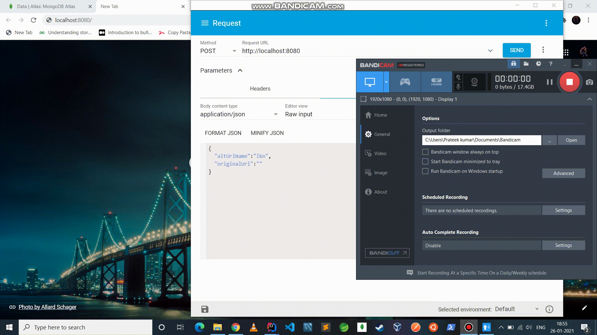

# URL-Shortner
This Application is Based on Nodejs And Basically helps us to shorten by letting us give our URL desired name.

### Database Models Depiction 
_id:60105485d29d482f44c774e3
altUrlName:"twt"
originalUrl:"http://www.twitter.com"
newUrl:"http://host/twt"

 / 
